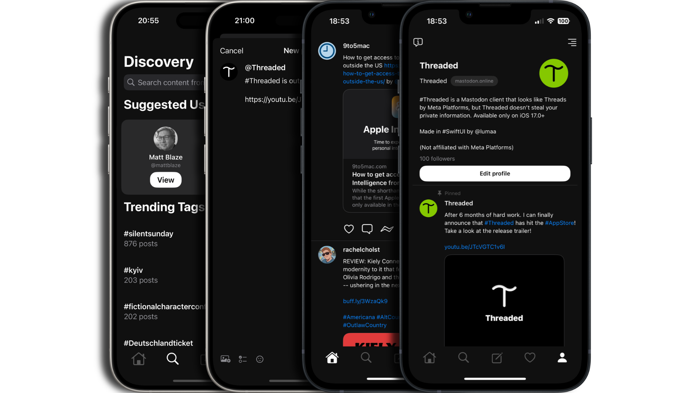

# [Threaded](https://apps.lumaa.fr/app/threaded)

[Threaded](https://apps.lumaa.fr/app/threaded) is a very simple [#Mastodon](https://joinmastodon.org) client, that is meant to look like the newest social media [#Threads](https://threads.net/) made by Meta Platforms. It integrates perfectly with your Mastodon account, and matches the Threads vibe, while having Mastodon-only features.

Threaded is free, made in SwiftUI, [#OpenSource](https://github.com/lumaa-dev/ThreadedApp), and doesn't violate [#YourPrivacy](https://apps.lumaa.fr/legal/privacy?app=threaded). Follow the [#ThreadedAccount](https://mastodon.online/@Threaded) on Mastodon, for progress, updates, polls, and more...

Threaded **will** also includes its own premium service, available as a subscription and lifetime payment, called Threaded+ (or Plus for short). Plus only adds additional features to Threaded, you don't need a subscription to like, post, bookmark, or use any existing Mastodon feature. Currently, all available Threaded+ features are free, until further notice.

With Threaded+, you can have a better Content Filter, you can save attachments, you get exclusive sneak peeks to Threaded's next updates, and other premium features! 

Use the **#Threaded** and **@Threaded@mastodon.online** on [Mastodon](https://mastodonshare.com/?text=@Threaded@mastodon.online+%2523Threaded)\
Join the Threaded Discord server to receive help, talk about the Fediverse, and many other things: [Join Threaded](https://discord.gg/MaHcRbkX46)\
Join the Matrix Space to get support, with full security: [Join #threadedapp:matrix.org](https://matrix.to/#/#threadedapp:matrix.org)

## Credits
- [Lumaa](https://lumaa.fr/) - Developer
- [@Damon](https://social.wedistribute.org/@damon)
- [IceCubesApp](https://github.com/dimillian/IceCubesApp) by [@Dimillian](https://github.com/dimillian)
- [Instance Blocklist](https://codeberg.org/oliphant/blocklists/raw/branch/main/blocklists/_unified_tier0_blocklist.csv)

## Packages
- A derivative of [ProboscisKit](https://github.com/lumaa-dev/ProboscisKit)
- [SwiftSoup](https://github.com/scinfu/SwiftSoup)
- [Nuke](https://github.com/kean/Nuke)
- [EmojiText](https://github.com/divadretlaw/EmojiText)
- [KeychainSwift](https://github.com/evgenyneu/keychain-swift)
- [RevenueCat](https://www.revenuecat.com/)

## Special thanks
- Beezus
- Beta testers on TestFlight

## More
Threaded is not related or affiliated with Meta Platforms.\
[Privacy Policy](https://apps.lumaa.fr/legal/privacy?app=threaded&utm_source=ThreadedGit)\
[About Threaded](https://apps.lumaa.fr/app/threaded)
